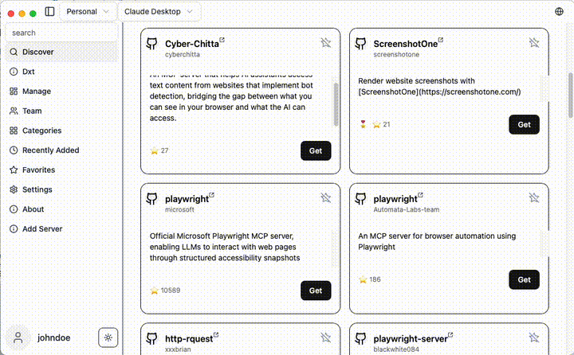
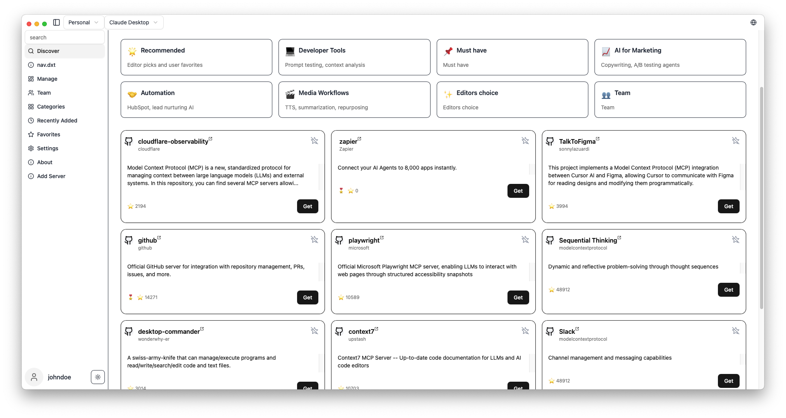
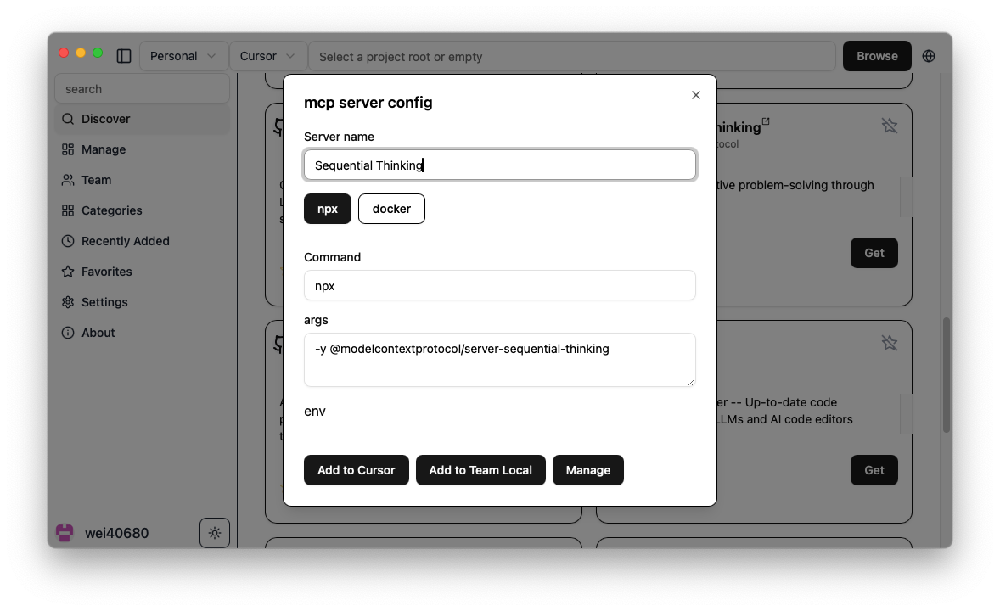

# MCP Linker

[](https://github.com/milisp/mcp-linker/stargazers)
[](https://github.com/milisp/mcp-linker/releases)
[](#)
[](CONTRIBUTING.md)

🌐 **Languages**: [中文](docs/README.zh-CN.md) | [🌍 Other Languages](./docs/)

**One-click add and sync MCP servers across AI clients — No LLM calls needed, Built-in marketplace**

> [!TIP]
> ⭐ Star the repo and follow **milisp** on [Twitter](https://x.com/lisp_mi) and [GitHub](https://github.com/milisp) for more!



## 🚀 Why MCP Linker?

- ⚡ **Instant** — Add MCP servers in seconds
- 🧠 **Multi-Client Support(paid plan)** — Works with all major AI clients

## ✨ Features

- **Local Sync** — Sync MCP server configs across multiple clients
- **600+ Curated MCP Servers** — Built-in marketplace with sequential-thinking, desktop-commander, and more
- **Multi-Client Support** — Claude Desktop/Code, Cursor, VS Code, Cline, Windsurf, Codex, Roo Code. [see Detail](./docs/clients.md)
- **Cross-Platform** — macOS, Windows, Linux
- **Smart Detection** — Auto-detect Python, Node.js, uv environments
- **Cloud Sync** — Optional encrypted sync across devices (Pro)
- **GUI for OpenAI Codex CLI** — based on [Codexia](https://github.com/milisp/codexia)

## 🚀 Quick Start

### Installation

**macOS (Homebrew)**
```bash
brew tap milisp/mcp-linker
brew install --cask mcp-linker
```

**Windows / Linux / macOS (Direct Download)**
Download the: [📥latest Releases](https://github.com/milisp/mcp-linker/releases)

### Getting Started

1. **Browse** MCP servers in the built-in marketplace
2. **Click "Get"** to show configuration
3. **Click "Add"** to install to your selected client
4. **Done!** Start using new AI capabilities immediately

## Screenshots

| Server Discovery | Add Configuration |
|-----------------|-------------------|
|  |  |

## What's MCP?
Model Context Protocol is like USB-C for AI — a standard way to connect AI models to different data sources and tools.

## 🧭 Related Projects

- [milisp/codexia](http://github.com/milisp/codexia) - The missing GUI for the OpenAI Codex CLI, (FileTree + notepad + git diff + plan mode) all in a lightweight Tauri desktop app.
- [**awesome-claude-dxt**](https://github.com/milisp/awesome-claude-dxt) — a curated list of Claude Desktop Extensions (dxt), tools, and resources

## 💬 Community & Support

- [💬 Join Discussions](https://github.com/milisp/mcp-linker/discussions)
- [🐛 Report Issues](https://github.com/milisp/mcp-linker/issues)
- [☁️ Pro Plans](https://mcp-linker.store/pricing) — Cloud sync starting at coffee price/month

## 🛠️ Development

For development commands, and contribution guidance, see [CONTRIBUTING](CONTRIBUTING.md)

## 🔍 Troubleshooting

see the [Wiki](https://github.com/milisp/mcp-linker/wiki)

## 💖 Contributors

Thanks to all our wonderful contributors!

<a href="https://github.com/milisp/mcp-linker/graphs/contributors">
  
</a>

## License

MCP Linker is dual-licensed under **AGPL-3.0** and a **Commercial License**.

- **AGPL-3.0** — for open-source use.
- **Commercial License** — required for closed-source, proprietary, hosted, or SaaS use.

---
**Found this helpful? Please ⭐ the project!**

## 📈 Star History

[](https://star-history.com/#milisp/mcp-linker)