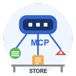
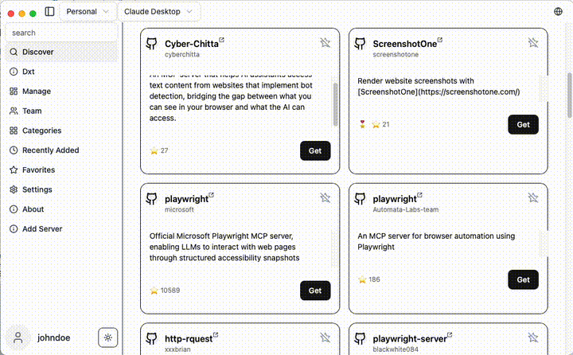
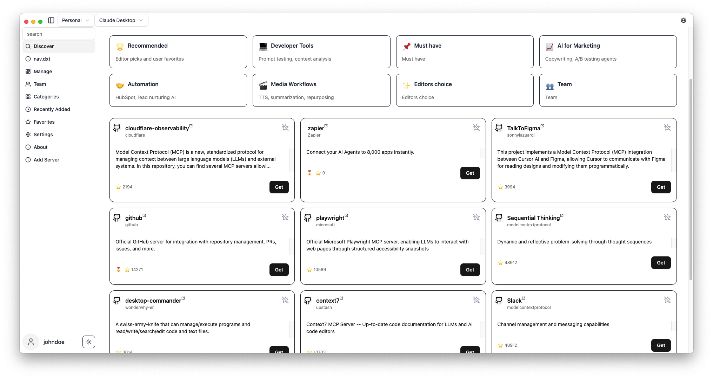
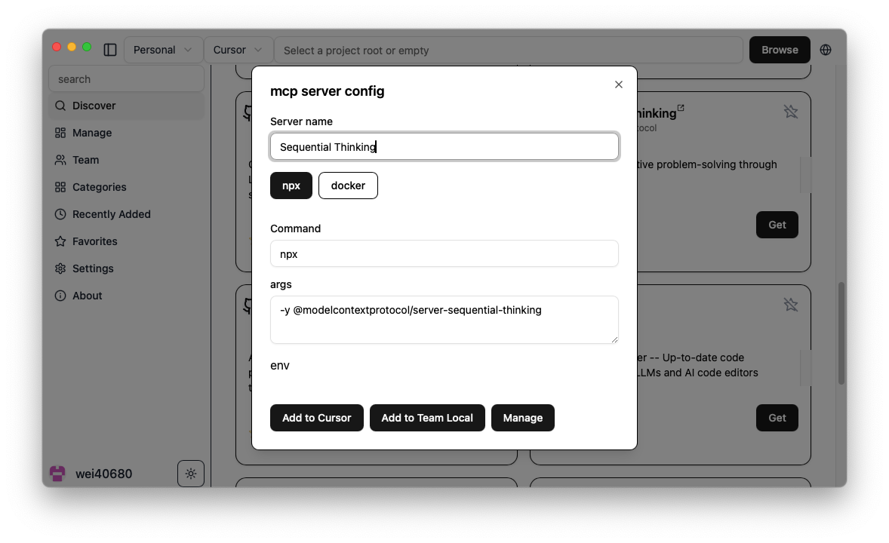

# MCP Linker

<div align="center">

Ajoutez, gérez et synchronisez des serveurs MCP (Model Context Protocol) sur des clients IA comme Claude Desktop, Cursor et Cline — le tout via une interface Tauri légère avec un marketplace intégré de serveurs MCP.



⚡️ **Fini le copier-coller**

[](https://github.com/milisp/mcp-linker/stargazers)
[](https://github.com/milisp/mcp-linker/releases)
[](https://github.com/milisp/mcp-linker/releases)

### 🌟 **Vous aimez ce projet ? Donnez une étoile !** 🌟

---

### 🚀 Commencez en 30 secondes

[📥 **Télécharger maintenant**](https://github.com/milisp/mcp-linker/releases) • [🚀 Démarrage rapide](#démarrage-rapide) • [💬 Rejoignez Discord](https://discord.gg/UqXeVqUKQq)

</div>

---

## ✨ Pourquoi choisir MCP Linker ?

**La façon la plus rapide d'améliorer votre flux de travail IA**



### 🎯 Fonctionnalités clés

- **🚀 Installation en un clic** — Fini les fichiers de configuration à la main
- **🔄 Support multi-clients** — Claude Desktop, Cursor, VS Code, Cline, Roo Code, Windsurf, et plus
- **📦 600+ serveurs sélectionnés** — Marketplace MCP intégré
- **🌐 Multi-plateforme** — macOS, Windows, Linux (léger ~6MB)
- **🔍 Détection intelligente** — Détection automatique de Python, Node.js, UV
- **⚡ Construit avec Tauri** — Rapide, sécurisé, et économe en ressources

### 💎 Avantages révolutionnaires

- Synchronisez les configurations de serveurs MCP sur tous vos clients MCP.
- Les utilisateurs Pro obtiennent 🔐 la synchronisation cloud chiffrée.
- Fonctionnalités de collaboration en équipe !\*\*

## 🚀 Démarrage rapide

**Commencez en moins d'une minute :**

1. **[📥 Téléchargez la dernière version](https://github.com/milisp/mcp-linker/releases)**
2. **🔍 Parcourez** notre marketplace MCP
3. **➕ Cliquez sur "Ajouter"** pour installer et configurer automatiquement
4. **🎉 Terminé !**

> **💡 Astuce :** Ajoutez une étoile à ce dépôt pour recevoir les nouveautés de serveurs et fonctionnalités !

## 🚀 Passez à MCP-Linker Pro ou Team

Accédez à la synchronisation cloud, et plus encore !  
👉 [Voir les niveaux et s'abonner](https://mcp-linker.milisp.dev/pricing)

## 📸 Captures d'écran

| Gérer                           | 🔍 Découverte des serveurs      | ⚙️ ajouter serveur                |
| ------------------------------- | ------------------------------- | ------------------------------- |
|  |  |  |

---

## 🛠️ Développement

```bash
git clone https://github.com/milisp/mcp-linker
cd mcp-linker
bun install
cp .env.example .env
bun tauri dev
```

**Pré-requis :** Node.js 20+, Bun, Rust toolchain

---

## 🏗️ Architecture

- **Frontend :** Tauri + React + shadcn/ui
- **Backend :** FastAPI optionnel

---

## 🤝 Contribuer

Les contributions sont les bienvenues ! Voir [CONTRIBUTING.md](./CONTRIBUTING.md) pour plus de détails.

**Ce projet vous est utile ? Merci de lui donner une ⭐ !**

---

## 💬 Support & Communauté

- **[💬 Rejoignez notre communauté Discord](https://discord.gg/UqXeVqUKQq)** — Obtenez de l'aide, partagez vos idées, et connectez-vous avec d'autres utilisateurs
- **[🐛 Signalez des problèmes](https://github.com/milisp/mcp-linker/issues)** — Aidez-nous à améliorer le projet

---

## 🎉 Contributeurs incroyables

Merci à notre superbe communauté de contributeurs qui améliore MCP Linker chaque jour :

[](https://github.com/milisp/mcp-linker/graphs/contributors)

**Remerciements particuliers à :**

- [@eltociear](https://github.com/eltociear) — Traduction japonaise
- [@devilcoder01](https://github.com/devilcoder01) — Compatibilité Windows, amélioration UI, workflows GitHub 🛠️
